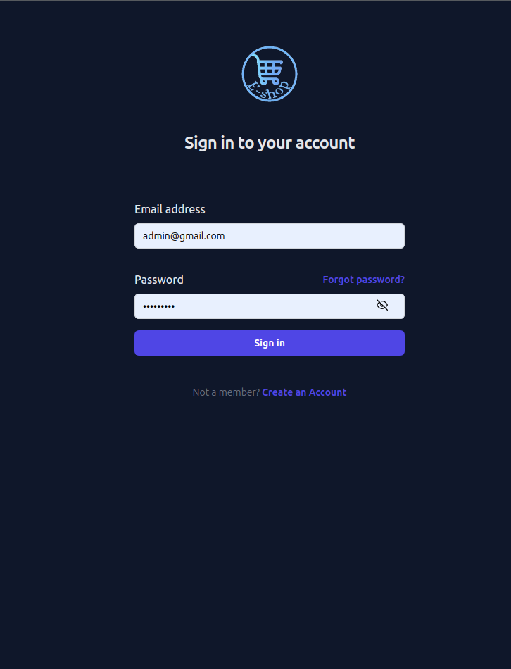
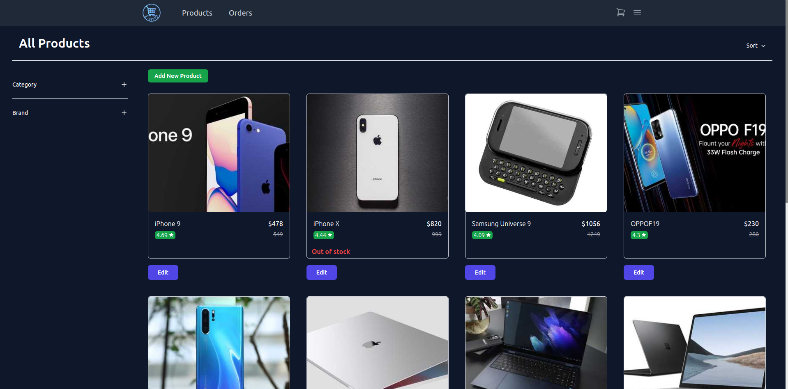
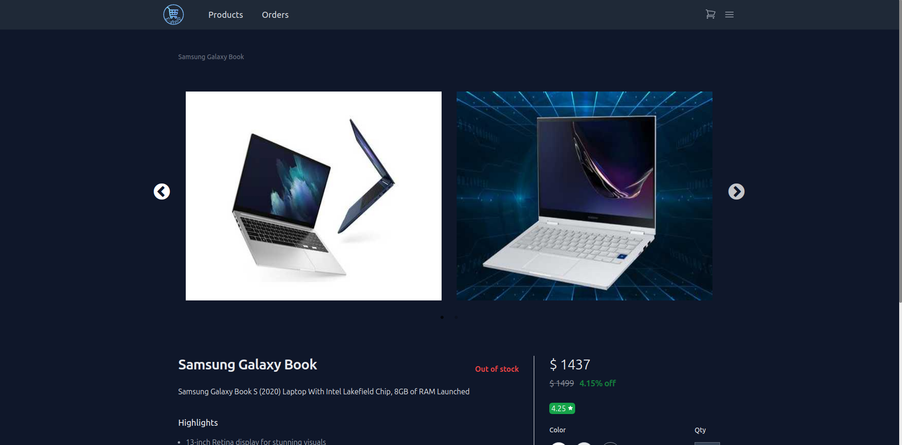
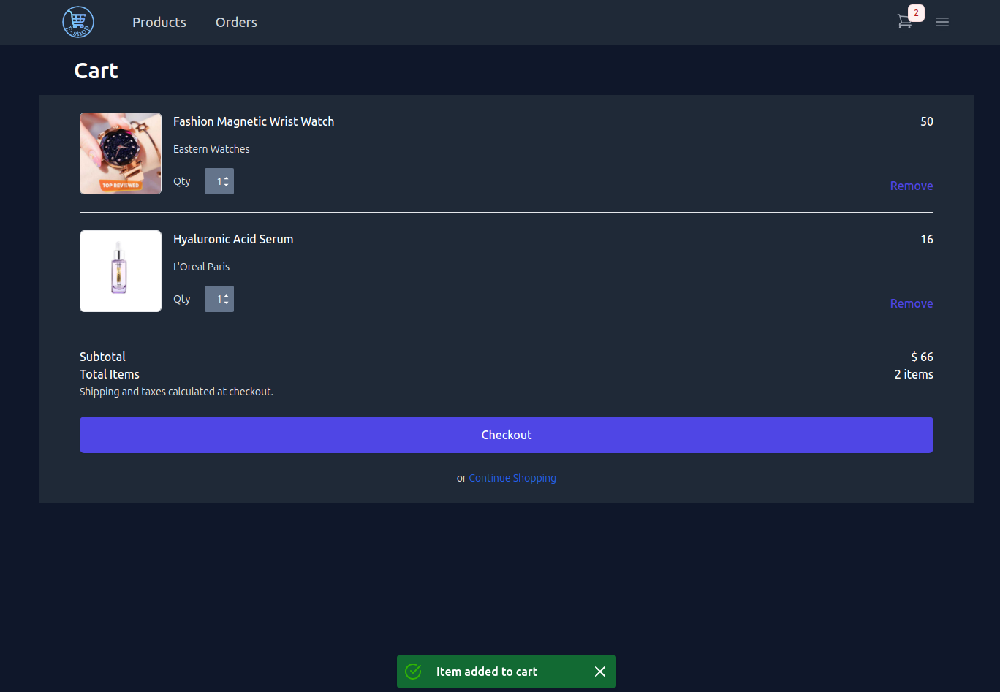

# Snappy - Chat Application 
Snappy is chat application build with the power of MERN Stack & Socket io. You can do realtime chat with friends with stunning UI website.
### Live link: [here](https://durgesheshop.vercel.app/)








## Installation Guide

### Requirements
- [Nodejs](https://nodejs.org/en/download)
- [Mongodb](https://www.mongodb.com/docs/manual/administration/install-community/)

Both should be installed and make sure mongodb is running.

```shell
git clone https://github.com/durgeshmehar/E-commerce-Website.git
cd E-commerce-Website.git
```
Now for Building the frontend
 ```shell
cd ecommerce frontend
npm install
npm run build
```
Rename the dist folder to build 

copy build folder in ecommerce backend

Now installing dependencies on backend

 ```shell
cd ecommerce backend
npm install
npm run dev
```
Done! Now open localhost:3000 in your browser.
